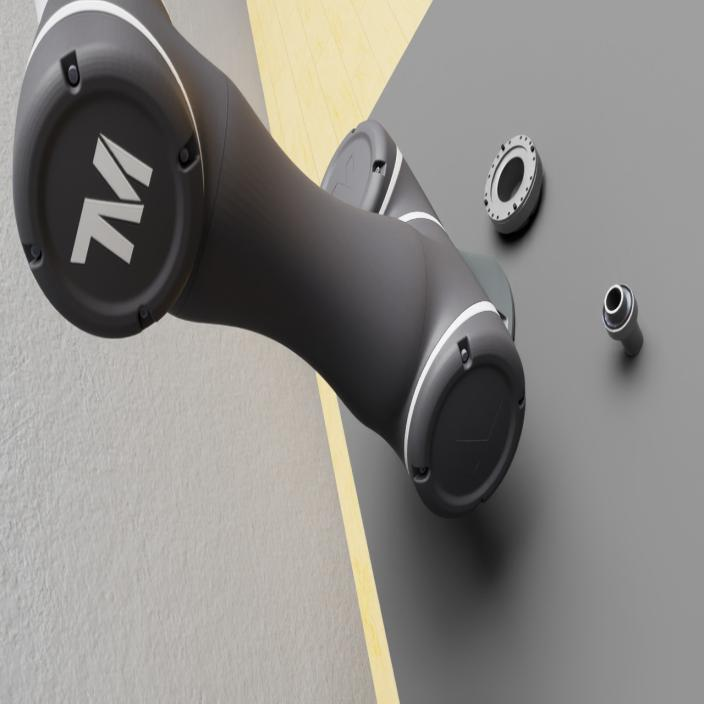
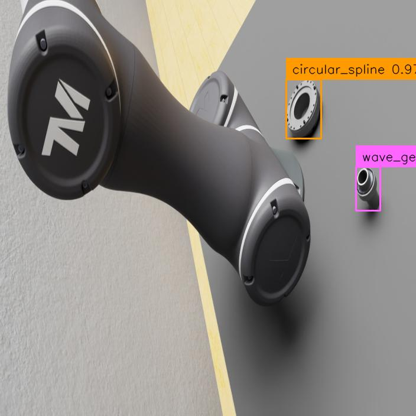
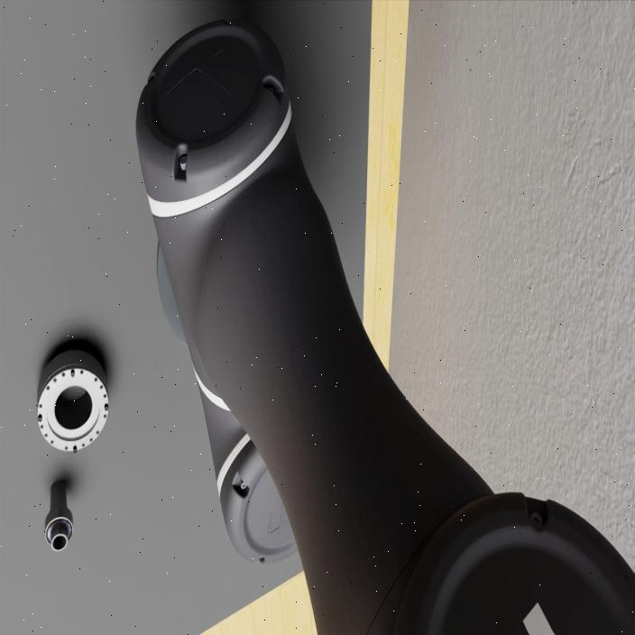
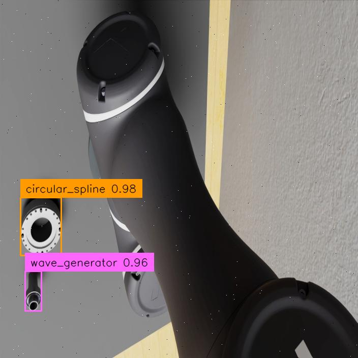

# Dual-Arm Robot Object Detection with DETR and RF-DETR

This project implements two transformer-based object-detection approaches for a dual-arm robotic assembly application:

- **DETR**, located in [`detr/`](detr/)
- **RF-DETR**, located in [`rf-detr/`](rf-detr/)

Both models are trained and evaluated using **my own custom dataset** rather than a public benchmark dataset. The dataset contains simulation images from the dual-arm robot environment and real images collected from the physical setup.

## Objective

The objective is to detect harmonic-drive components before robotic manipulation and assembly. The current object classes are:

- `circular_spline`
- `wave_generator`

The detector returns the object class, confidence score, and bounding box. These outputs can later be connected to the robot perception and manipulation pipeline for object localization, grasp planning, and assembly.

## Repository Structure

```text
.
├── detr/              # DETR implementation
├── rf-detr/           # RF-DETR implementation
├── datasets/          # Custom dual-arm robot dataset
├── results/           # Input images and detection results
└── README.md
```

## Dataset

The custom dataset includes:

- Synthetic images generated in the dual-arm robot simulation
- Real camera images of the harmonic-drive components
- Different viewpoints, object orientations, scales, and robot-arm occlusions
- Bounding-box annotations for `circular_spline` and `wave_generator`

The main workflow is:

```text
Image Collection → Bounding-Box Annotation → Dataset Split
                 → Model Training → Inference → Result Visualization
```

## RF-DETR Implementation

RF-DETR is fine-tuned on the custom dual-arm robot dataset. In this project, it is used as the main detector because it provides a transformer-based detection pipeline suitable for both simulated and real robot images.

The implementation performs the following steps:

1. Loads the custom annotated dataset.
2. Fine-tunes RF-DETR for the two target classes.
3. Runs inference on simulation and real-world images.
4. Draws the predicted class, confidence score, and bounding box.
5. Saves the visualized predictions in the [`results/`](results/) directory.

## Qualitative Results

The following examples are results from **my custom dataset**. They are not results from COCO or another public dataset.

### Simulation Dataset

<table>
<tr>
<td align="center"><b>Input</b></td>
<td align="center"><b>RF-DETR Result</b></td>
</tr>
<tr>
<td></td>
<td></td>
</tr>
<tr>
<td></td>
<td></td>
</tr>
</table>

The simulation results show that RF-DETR can detect the components from different camera viewpoints, including cases where the robot arm partially blocks the scene.

### Real-World Dataset

<table>
<tr>
<td align="center"><b>Input</b></td>
<td align="center"><b>RF-DETR Result</b></td>
</tr>
<tr>
<td></td>
<td></td>
</tr>
<tr>
<td></td>
<td></td>
</tr>
</table>

The real-world examples show detections under different component appearances, orientations, and lighting conditions. The displayed confidence values are model predictions for each individual image.

## DETR and RF-DETR

The [`detr/`](detr/) folder contains the baseline DETR implementation, while [`rf-detr/`](rf-detr/) contains the RF-DETR implementation used for the custom robotic dataset.

| Implementation | Purpose |
|---|---|
| DETR | Baseline transformer detector for comparison and experimentation |
| RF-DETR | Main fine-tuned detector for the dual-arm robot dataset |

A complete comparison should use the same train, validation, and test split and report metrics such as precision, recall, mAP@50, mAP@50:95, and inference latency.

## Current Status

- [x] Prepare a custom dual-arm robot dataset
- [x] Define the `circular_spline` and `wave_generator` classes
- [x] Implement DETR
- [x] Implement and fine-tune RF-DETR
- [x] Test on simulation images
- [x] Test on real-world images
- [ ] Add quantitative DETR versus RF-DETR evaluation
- [ ] Connect detection results to robot grasping and assembly

## Notes

This repository contains an application and fine-tuning of DETR-based detectors for a custom robotic dataset. RF-DETR itself was developed by Roboflow; this project focuses on training, evaluation, and integration for the dual-arm robot use case.
