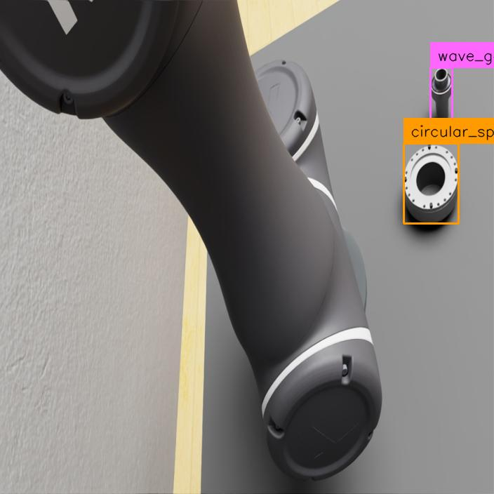
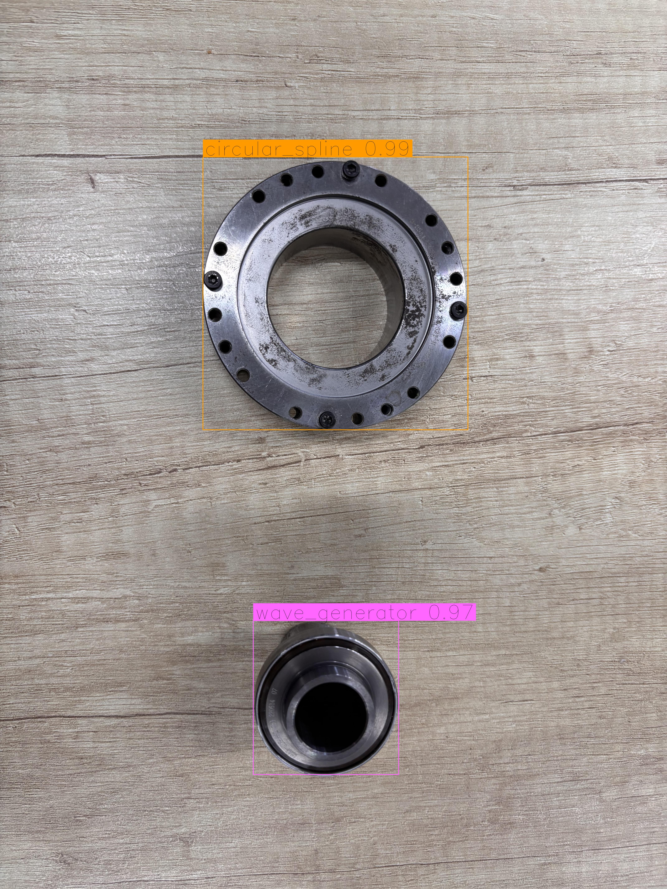
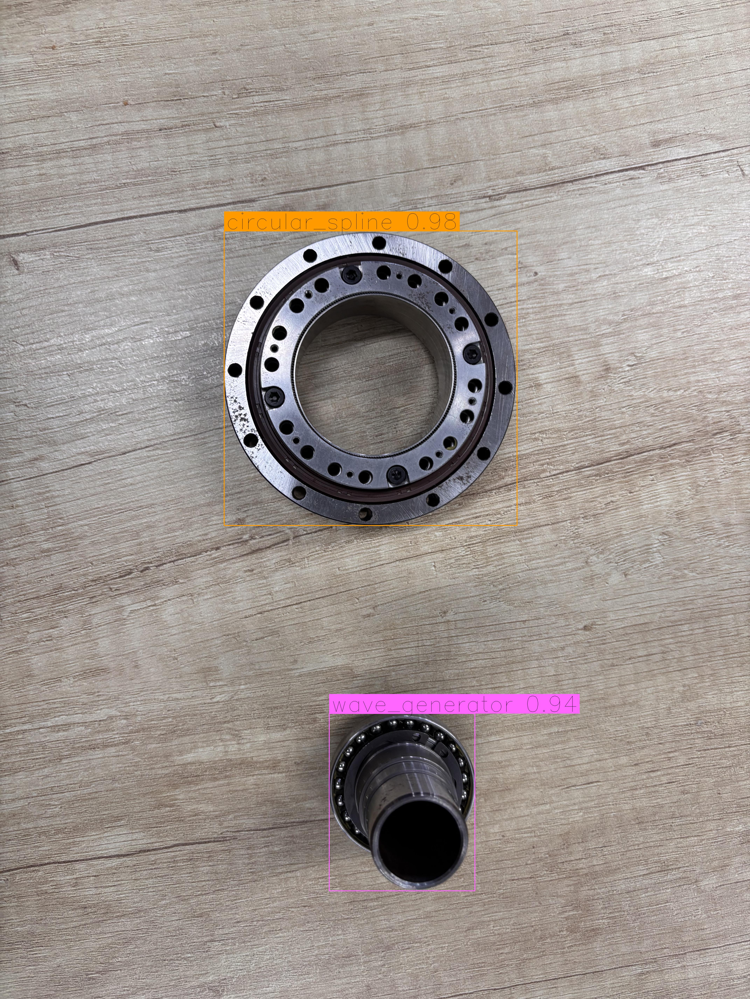
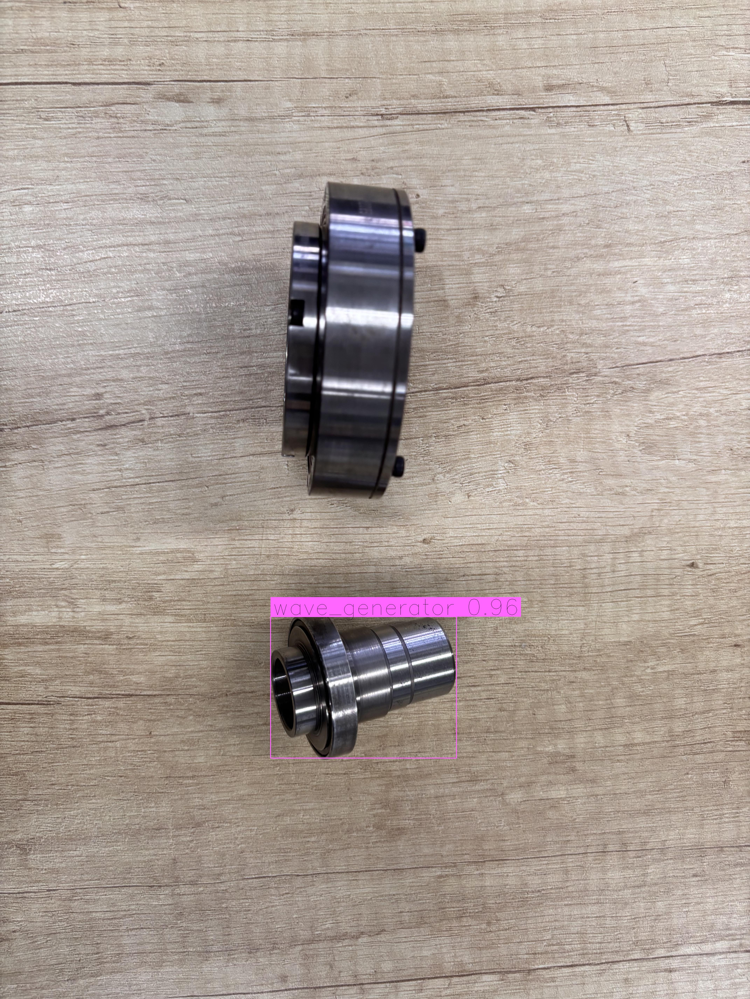

# DETR and RF-DETR for Dual-Arm Robot Component Detection

This project implements two transformer-based object detection approaches for a dual-arm robotic assembly task:

- `detr/` — a standard DETR implementation used as a baseline.
- `rf-detr/` — an RF-DETR implementation fine-tuned on my own robotic dataset.

The objective is to detect mechanical components in both simulated and real-world scenes before robotic manipulation and assembly.

## Dataset

This project uses my custom dual-arm robot dataset, **`Harmonic_Drive-7`**. The dataset contains **2,918 annotated images** divided into the following splits:

| Split | Number of images |
|---|---:|
| Training | 2,619 |
| Validation | 249 |
| Test | 50 |
| **Total** | **2,918** |

The dataset includes images from simulation and the real dual-arm robot workcell. It is used to train and evaluate both DETR and RF-DETR under the same task conditions.

## Detected Objects

The dataset contains two object classes:

- `circular_spline`
- `wave_generator`

The images include different camera viewpoints, robot-arm occlusion, object orientations, lighting conditions, and backgrounds. Both simulation images and real camera images are used to evaluate whether the detector can generalize to the physical setup.

## Project Structure

```text
.
├── detr/          # Standard DETR implementation
├── rf-detr/       # RF-DETR training and inference implementation
├── result/        # Detection result images
├── results.json   # RF-DETR evaluation metrics
└── README.md
```

## RF-DETR Results

The following results were obtained from RF-DETR trained on my custom dual-arm robot dataset.

### Validation Set

| Class | mAP@50 | mAP@50:95 | Precision | Recall | F1-score |
|---|---:|---:|---:|---:|---:|
| `circular_spline` | 0.9900 | 0.9208 | 0.9942 | 0.9942 | 0.9942 |
| `wave_generator` | 1.0000 | 0.8776 | 1.0000 | 1.0000 | 1.0000 |
| **Overall** | **0.9950** | **0.8992** | **0.9971** | **0.9971** | **0.9971** |

### Test Set

| Class | mAP@50 | mAP@50:95 | Precision | Recall | F1-score |
|---|---:|---:|---:|---:|---:|
| `circular_spline` | 1.0000 | 0.9571 | 1.0000 | 1.0000 | 1.0000 |
| `wave_generator` | 1.0000 | 0.9291 | 1.0000 | 1.0000 | 1.0000 |
| **Overall** | **1.0000** | **0.9431** | **1.0000** | **1.0000** | **1.0000** |

RF-DETR achieved an overall test **mAP@50:95 of 0.9431** and perfect test values for **mAP@50, precision, recall, and F1-score** on this dataset.

## Qualitative Results

### Simulation Environment

<p align="center">
  
  
  
</p>

The model detects the components even when the dual-arm robot partially blocks the camera view.

### Real-World Environment

<p align="center">
  
  
  
</p>

The real-world results show that the model can detect the same components under different orientations and viewing angles.

## Implementation Summary

The implementation follows this workflow:

1. Collect images from the dual-arm robot simulation and the real workcell.
2. Annotate the `circular_spline` and `wave_generator` objects.
3. Train DETR as a baseline detector.
4. Fine-tune RF-DETR using the same custom dataset.
5. Evaluate the model using mAP, precision, recall, and F1-score.
6. Save annotated inference images in the `result/` directory.

## Current Scope

This repository currently focuses on object detection. The detected bounding boxes and class labels can later be connected to the dual-arm robot perception and manipulation pipeline for object localization, grasp planning, and assembly.
